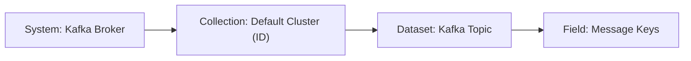

# Onboarding New Data Sources

This project provides a Kafka data processing pipeline that retrieves and processes Kafka topic metadata and message data, transforms them into datasets, and pushes them to a data dictionary system compatible with Apache Atlas. The pipeline consists of functions to connect to Kafka, retrieve topic metadata, consume messages, parse data in JSON or Avro formats, and upload formatted data into the desired target system.

## Datamodel:

The following datamodel is created by discovering the kafka cluster.

- **System** - Kafka Broker: 
  
  This component is the Kafka Broker that represents the technical system.

- **Collection** - Default Cluster (ID)

  This refers to a specific Kafka cluster that organizes and manages topics.

- **Dataset** - Kafka Topic

  A Kafka topic is a category or feed name to which messages are published. 

- **Field** - Message keys

  This refers to the keys associated with the messages in a topic. 
