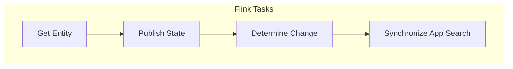
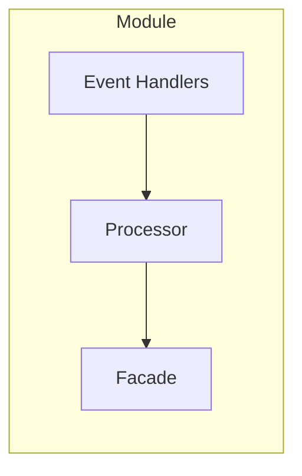

# Flink Tasks

The `flink_tasks` package contains all tasks that are used as part of the Flink data processing pipeline of Aurelius Atlas.

## Structure

The `flink_tasks` package contains the following sub-packages:

- `flink_tasks.model`: Contains the data model of the Flink data processing pipeline.
- `flink_tasks.operations`: Contains the processing steps that are used as part of the Flink data processing pipeline.

## Architecture

This section describes the architecture of the Flink data processing pipeline of Aurelius Atlas.

### Data Flow

The Flink data processing pipeline is based on the [Flink Streaming API](https://nightlies.apache.org/flink/flink-docs-release-1.18/docs/dev/datastream/overview/). The pipeline is structured as follows:

> **Note**: External dependencies are not shown in the diagram.

Below is a functional description of each processing step:

| Step                   | Description                                                                                                 |
| ---------------------- | ----------------------------------------------------------------------------------------------------------- |
| `GetEntity`            | Upon receiving an entity notification, retrieves the full entity from Apache Atlas.                         |
| `PublishState`         | Publishes the new state of the Entity to Kafka.                                                             |
| `DetermineChange`      | Determines the change in state of the Entity.                                                               |
| `SynchronizeAppSearch` | Retrieves all documents affected by the change from Elasticsearch and updates them to maintain consistency. |

### Module Structure

Every processing step is implemented as a separate module. The modules are structured as follows:

The main interface for each processing step is the `Facade` component. It is responsible for applying the `Processor` to a given input stream of events. The `Facade` provides several output streams that can be used to connect the processing step to other processing steps. Every `Facade` must have a `main` output for the happy flow, and can have additional outputs for error handling. For convenience, every `Facade` has an `error` output that can be used to connect the processing step to a generic error handling component.

The `Processor` component is responsible for processing a single event. It is the main component of the processing step. The `Processor` can use the `EventHandlers` component to handle the different types of events that are received by the processing step.
